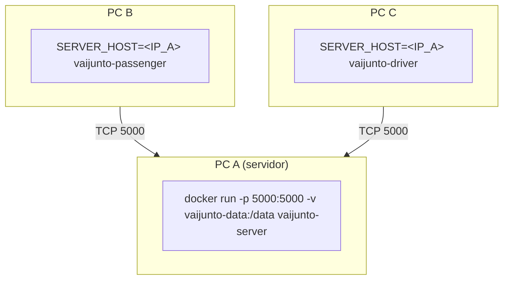

# VAIJUNTO

Sistema de **caronas compartilhadas** (PBL de Redes, Concorrência e Conectividade). Servidor central em Go fala **TCP/IP nativo** com um cliente **motorista** e um cliente **passageiro**. Itinerários podem juntar caronas diferentes. A reserva é **atômica** (tudo ou nada) com concorrência explícita (`goroutine` por conexão + `sync.RWMutex`). Estado em memória + arquivo JSON (sobrevive a reinício e a `docker rm` com volume).

Entrega: 17/09/2026. Relatório SBC: `relatorio/relatorio-sbc.md`.

## Contas da demo

Senha de todas: `senha123`

| usuário | papel |
|---|---|
| motorista1, motorista2 | DRIVER |
| passageiro1, passageiro2, passageiro3 | PASSENGER |

Preços em **centavos** (1500 = R$ 15,00).

## Build e teste

```bash
go test ./...
go test -race ./...
go build -o bin/server ./cmd/server
go build -o bin/driver ./cmd/driver
go build -o bin/passenger ./cmd/passenger
```

## Rodar em um PC

Terminal 1:

```bash
DATA_PATH=data/state.json ./bin/server
# escuta 0.0.0.0:5000
```

Terminal 2 (motorista):

```bash
SERVER_HOST=127.0.0.1 SERVER_PORT=5000 ./bin/driver
```

Terminal 3 (passageiro):

```bash
SERVER_HOST=127.0.0.1 SERVER_PORT=5000 ./bin/passenger
```

Smoke automático (última vaga + persistência):

```bash
bash scripts/smoke.sh
```

Cliente em outra linguagem:

```bash
python3 examples/python_ping.py 127.0.0.1 5000
```

## Docker (mesma máquina)

```bash
docker build -t vaijunto-server --build-arg BUILD_TARGET=server .
docker compose up -d
# volume vaijunto-data → /data/state.json
```

Clientes no host apontam para `127.0.0.1:5000`.

## Docker em três PCs do laboratório



PC A:

```bash
docker build -t vaijunto-server --build-arg BUILD_TARGET=server .
docker run -d --name vaijunto-server --restart unless-stopped \
  -p 5000:5000 -v vaijunto-data:/data \
  -e LISTEN_HOST=0.0.0.0 -e SERVER_PORT=5000 -e DATA_PATH=/data/state.json \
  vaijunto-server
ip -4 addr   # anote o IP da LAN, NÃO o 172.x do container
```

PC B e PC C (depois de `docker build` da imagem correspondente, ou copie a imagem):

```bash
docker build -t vaijunto-passenger --build-arg BUILD_TARGET=passenger .
docker run -it --rm -e SERVER_HOST=192.168.X.Y -e SERVER_PORT=5000 vaijunto-passenger

docker build -t vaijunto-driver --build-arg BUILD_TARGET=driver .
docker run -it --rm -e SERVER_HOST=192.168.X.Y -e SERVER_PORT=5000 vaijunto-driver
```

Firewall: liberar TCP 5000 no PC A. Se o cliente usar o IP interno do container, a conexão falha — use o IP do **host**.

Persistência no Docker: o volume `vaijunto-data` sobrevive a `docker rm`. A sessão TCP não: após `docker restart` faça `LOGIN` outra vez.

## Documentação

| arquivo | conteúdo |
|---|---|
| `docs/PROTOCOL.md` | protocolo completo (dá para escrever um cliente Python) |
| `docs/ARCHITECTURE.md` | componentes e modelo |
| `docs/CONCURRENCY.md` | locks, atomicidade, invariantes |
| `docs/DECISIONS.md` | decisões de projeto vs enunciado |
| `docs/TESTING.md` | como testar |
| `STUDY_GUIDE.md` | estudo dirigido |
| `DEFESA_ORAL.md` | 11 itens do barema |
| `CHAT.md` | contexto mestre do grupo |

## Layout do código

```text
cmd/server driver passenger loadtest smoke
internal/protocol domain store search service server client config
```

Comentários no código explicam **por que** (framing, lock, grafo), não a sintaxe.

## Invariantes

Disponibilidade nunca negativa nem acima da capacidade; reserva composta atômica; cancelamento restaura uma vez; busca não segura vaga; cliente morto não derruba o servidor; JSON inválido não muta estado; dados persistidos reaparecem após restart.
