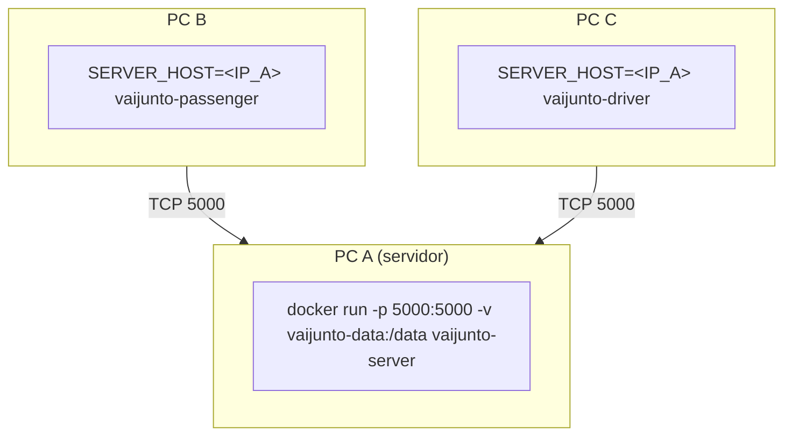

# VAIJUNTO

Sistema de **caronas compartilhadas** (PBL de Redes, Concorrência e Conectividade). Servidor central em Go fala **TCP/IP nativo** com um cliente **motorista** e um cliente **passageiro**. Itinerários podem juntar caronas diferentes. A reserva é **atômica** (tudo ou nada) com concorrência explícita (`goroutine` por conexão + `sync.RWMutex`). Estado em memória + arquivo JSON (sobrevive a reinício e a `docker rm` com volume).

Entrega: 17/09/2026.

## Contas da demo

Senha de todas: `senha123`

| usuário | papel |
|---|---|
| motorista1, motorista2 | DRIVER |
| passageiro1, passageiro2, passageiro3 | PASSENGER |

Também dá para **criar conta** no menu inicial de cada CLI (`2 criar conta`): só usuário, senha e confirmação. O servidor gera o ID. Sem CPF, e-mail ou telefone.

No **protocolo e no `state.json`** os preços continuam em **centavos** (`int64`, 1500 = R$ 15,00) e as datas em **YYYY-MM-DD**. Só a CLI pede data `DD/MM/AAAA` e preço em reais (`15`, `15,50` ou `15.50`), um trecho por vez.

## Pré-requisitos

Quem clona [https://github.com/yma1001/vaijunto](https://github.com/yma1001/vaijunto) precisa de:

- **Go 1.22 ou mais novo** (o `go.mod` declara `go 1.22`; confira com `go version`)
- **git**
- **Docker** opcional (demo em container)

Instale o Go em [https://go.dev/dl/](https://go.dev/dl/). Detalhes por sistema nas seções abaixo.

```bash
git clone https://github.com/yma1001/vaijunto.git
cd vaijunto
```

O caminho mais claro é **Linux** (laboratório da UEFS e a máquina do aluno). macOS e Windows repetem os mesmos testes, com as diferenças de instalação, variáveis de ambiente e nome dos binários.

## Build e teste

Linux (primeiro caminho):

```bash
go test ./...
go test -race ./...
go build -o bin/server ./cmd/server
go build -o bin/driver ./cmd/driver
go build -o bin/passenger ./cmd/passenger
```

Os mesmos `go test ./...` e `go test -race ./...` valem em macOS. No Windows, veja a seção Windows (`bin\*.exe` e `$env:...`).

## Rodar em um PC (Linux)

Três terminais. Contas da tabela acima; senha `senha123`.

Terminal 1:

```bash
cd /caminho/para/vaijunto
export DATA_PATH="$PWD/data/state.json"
./bin/server
# escuta 0.0.0.0:5000 — o log mostra o caminho absoluto do JSON
```

(`DATA_PATH=data/state.json ./bin/server` também vale **se** o cwd for a raiz do repositório. Relativo segue o diretório de trabalho, não o do binário.)

Terminal 2 (motorista):

```bash
export SERVER_HOST=127.0.0.1
export SERVER_PORT=5000
./bin/driver
# menu: 1 entrar  2 criar conta  3 PING  0 sair
# publicar: cidades livres (mínimo 2), data DD/MM/AAAA, preço por trecho em R$
```

Terminal 3 (passageiro):

```bash
export SERVER_HOST=127.0.0.1
export SERVER_PORT=5000
./bin/passenger
```

Smoke automático (última vaga + persistência):

```bash
bash scripts/smoke.sh
```

Cliente em outra linguagem:

```bash
python3 examples/python_ping.py 127.0.0.1 5000
```

## Persistência e DATA_PATH (não confundir com IP)

O JSON **não** guarda o IP do servidor. `SERVER_HOST` só diz ao **cliente** onde conectar. Trocar de rede, voltar para casa ou anotar outro IP **não** deve apagar reservas.

O que parece “sumiu tudo, mas passageiro1 ainda entra” é quase sempre **dois arquivos** com o mesmo seed (`motorista1` / `passageiro1`…):

| Como sobe o servidor | Arquivo |
|---|---|
| `./bin/server` na raiz do clone, `DATA_PATH=data/state.json` | `<clone>/data/state.json` (relativo ao **cwd**) |
| `./bin/server` iniciado de outro diretório com o mesmo relativo | **outro** `data/state.json` naquele cwd |
| Docker (`docker compose` / `docker run -v vaijunto-data:/data`) | volume `vaijunto-data` → `/data/state.json` **dentro** do container |

Os dois têm as contas seed, então o LOGIN funciona. Caronas e reservas ficaram no arquivo que **não** está aberto agora.

**Ubuntu / Linux (laboratório ou em casa)** — fixe um caminho absoluto e suba sempre o mesmo processo/volume:

```bash
cd /caminho/para/vaijunto
export DATA_PATH="$PWD/data/state.json"
./bin/server
```

O log na subida mostra `data=<caminho absoluto>`. Depois de um restart, no cliente passageiro: `LOGIN` de novo e **3) minhas reservas** (isso manda `LIST_RESERVATIONS` ao servidor; o cache local da CLI não sobrevive a restart/logout).

**Windows (binário local):** na raiz do clone, prefira caminho absoluto:

```powershell
$env:DATA_PATH = (Join-Path (Get-Location) "data\state.json")
.\bin\server.exe
```

**Windows / Linux / macOS + Docker:** use **sempre** o volume nomeado e `DATA_PATH=/data/state.json`. O IP (`SERVER_HOST`) muda; o volume não.

```bash
docker run -d --name vaijunto-server --restart unless-stopped \
  -p 5000:5000 -v vaijunto-data:/data \
  -e LISTEN_HOST=0.0.0.0 -e SERVER_PORT=5000 -e DATA_PATH=/data/state.json \
  vaijunto-server
```

Não misture `.\bin\server.exe` + `data\state.json` com esse container esperando as mesmas reservas. `docker compose down` **sem** `-v` mantém `vaijunto-data`. Não use `down -v` nem apague o volume se quiser conservar o estado.

Testes e smoke usam `DATA_PATH` temporário; não apontam para o `data/state.json` do aluno.

## macOS

Instale o Go com Homebrew (`brew install go`) ou pelo pacote em [https://go.dev/dl/](https://go.dev/dl/). `go version` deve ser 1.22 ou mais novo.

Clone, testes e build são iguais aos do Linux. Variáveis: os mesmos `export SERVER_HOST`, `SERVER_PORT` e `DATA_PATH`.

Três terminais. Senha da demo: `senha123`.

Terminal 1:

```bash
cd /caminho/para/vaijunto
export DATA_PATH="$PWD/data/state.json"
./bin/server
```

Terminal 2:

```bash
export SERVER_HOST=127.0.0.1
export SERVER_PORT=5000
./bin/driver
```

Terminal 3:

```bash
export SERVER_HOST=127.0.0.1
export SERVER_PORT=5000
./bin/passenger
```

Smoke: `bash scripts/smoke.sh` (funciona no Terminal do macOS).

Docker: [Docker Desktop](https://www.docker.com/products/docker-desktop/). Com o daemon no ar, os comandos da seção Docker abaixo são os mesmos.

## Windows

Instale o Go (msi) em [https://go.dev/dl/](https://go.dev/dl/) e o [Git for Windows](https://git-scm.com/download/win) (traz Git Bash). `go version` ≥ 1.22.

O **Git Bash** segue os comandos Linux (`export`, `./bin/server`, `bash scripts/smoke.sh`).

No **PowerShell**, as variáveis são `$env:SERVER_HOST`, `$env:SERVER_PORT` e `$env:DATA_PATH` (uma janela não herda a da outra). Os binários ficam em `bin\` com sufixo `.exe`.

```powershell
git clone https://github.com/yma1001/vaijunto.git
cd vaijunto
go test ./...
go test -race ./...
go build -o bin/server.exe ./cmd/server
go build -o bin/driver.exe ./cmd/driver
go build -o bin/passenger.exe ./cmd/passenger
```

Se `go test -race` falhar pedindo CGO/gcc, instale um gcc (MinGW-w64) ou rode no Git Bash/WSL. `go test ./...` continua válido.

Três janelas do PowerShell. Senha da demo: `senha123`.

Janela 1 (servidor):

```powershell
$env:DATA_PATH = (Join-Path (Get-Location) "data\state.json")
.\bin\server.exe
# escuta 0.0.0.0:5000
```

Janela 2 (motorista):

```powershell
$env:SERVER_HOST = "127.0.0.1"
$env:SERVER_PORT = "5000"
.\bin\driver.exe
```

Janela 3 (passageiro):

```powershell
$env:SERVER_HOST = "127.0.0.1"
$env:SERVER_PORT = "5000"
.\bin\passenger.exe
```

Smoke: no Git Bash, `bash scripts/smoke.sh`. No PowerShell nativo o script bash não roda; use `go test ./...` e a demo dos três `.exe`.

Firewall: em `127.0.0.1` em geral não pede nada. Se outro PC não conectar, libere **TCP 5000** no Windows Defender Firewall (e permita o `server.exe` se o Defender perguntar).

Docker: Docker Desktop para Windows. `docker build` / `docker compose` no PowerShell; `bash scripts/docker-local.sh` no Git Bash.

Cliente Python: `python examples/python_ping.py 127.0.0.1 5000`.

## Docker (mesma máquina)

Linux: Docker Engine. macOS e Windows: Docker Desktop. O script abaixo é bash (no Windows, Git Bash).

Script único (build + smoke + `docker restart` + persistência). O container do servidor permanece no ar:

```bash
bash scripts/docker-local.sh
```

Equivalente manual:

```bash
docker build -t vaijunto-server --build-arg BUILD_TARGET=server .
docker compose up -d
# volume vaijunto-data → /data/state.json
```

Clientes no host apontam para `127.0.0.1:5000`.

## Docker em três PCs do laboratório

O laboratório da UEFS é **Linux** (comandos abaixo). Cliente em macOS ou Windows: compile `driver`/`passenger` nessa máquina e aponte `SERVER_HOST` para o IP do PC A (`export SERVER_HOST=<IP do PC A>` no macOS/Linux; `$env:SERVER_HOST = "<IP do PC A>"` no PowerShell). O protocolo TCP é o mesmo.



PC A:

```bash
docker build -t vaijunto-server --build-arg BUILD_TARGET=server .
docker run -d --name vaijunto-server --restart unless-stopped \
  -p 5000:5000 -v vaijunto-data:/data \
  -e LISTEN_HOST=0.0.0.0 -e SERVER_PORT=5000 -e DATA_PATH=/data/state.json \
  vaijunto-server
ip -4 addr   # anote o IP da LAN, NÃO o 172.x do container
```

PC B e PC C (depois de `docker build` da imagem correspondente, ou copie a imagem):

```bash
docker build -t vaijunto-passenger --build-arg BUILD_TARGET=passenger .
docker run -it --rm -e SERVER_HOST=192.168.X.Y -e SERVER_PORT=5000 vaijunto-passenger

docker build -t vaijunto-driver --build-arg BUILD_TARGET=driver .
docker run -it --rm -e SERVER_HOST=192.168.X.Y -e SERVER_PORT=5000 vaijunto-driver
```

Firewall: liberar TCP 5000 no PC A. Se o cliente usar o IP interno do container, a conexão falha — use o IP do **host**.

Persistência no Docker: o volume `vaijunto-data` sobrevive a `docker rm` e a mudança de IP da LAN. A sessão TCP não: após `docker restart` faça `LOGIN` outra vez e `LIST_RESERVATIONS` (menu 3 no passageiro). Não rode ao mesmo tempo um `./bin/server` com `data/state.json` do clone — é outro arquivo.

## Documentação

| arquivo | conteúdo |
|---|---|
| `docs/PROTOCOL.md` | protocolo completo (dá para escrever um cliente Python) |
| `docs/ARCHITECTURE.md` | componentes e modelo |
| `docs/CONCURRENCY.md` | locks, atomicidade, invariantes |
| `docs/DECISIONS.md` | decisões de projeto vs enunciado |
| `docs/TESTING.md` | como testar |
| `docs/ROUTING_API.md` | análise (não implementada) de geocode/ETA |

## Layout do código

```text
cmd/server driver passenger loadtest smoke
internal/protocol domain store search service server client config cliui
```

Comentários no código explicam **por que** (framing, lock, grafo), não a sintaxe.

## Invariantes

Disponibilidade nunca negativa nem acima da capacidade; reserva composta atômica; cancelamento restaura uma vez; busca não segura vaga; cliente morto não derruba o servidor; JSON inválido não muta estado; dados persistidos reaparecem após restart.
