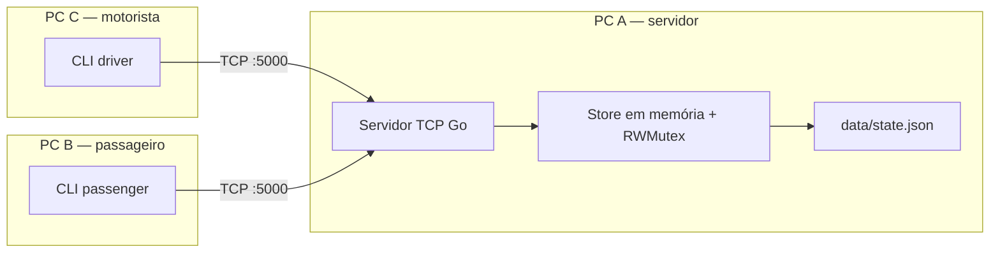
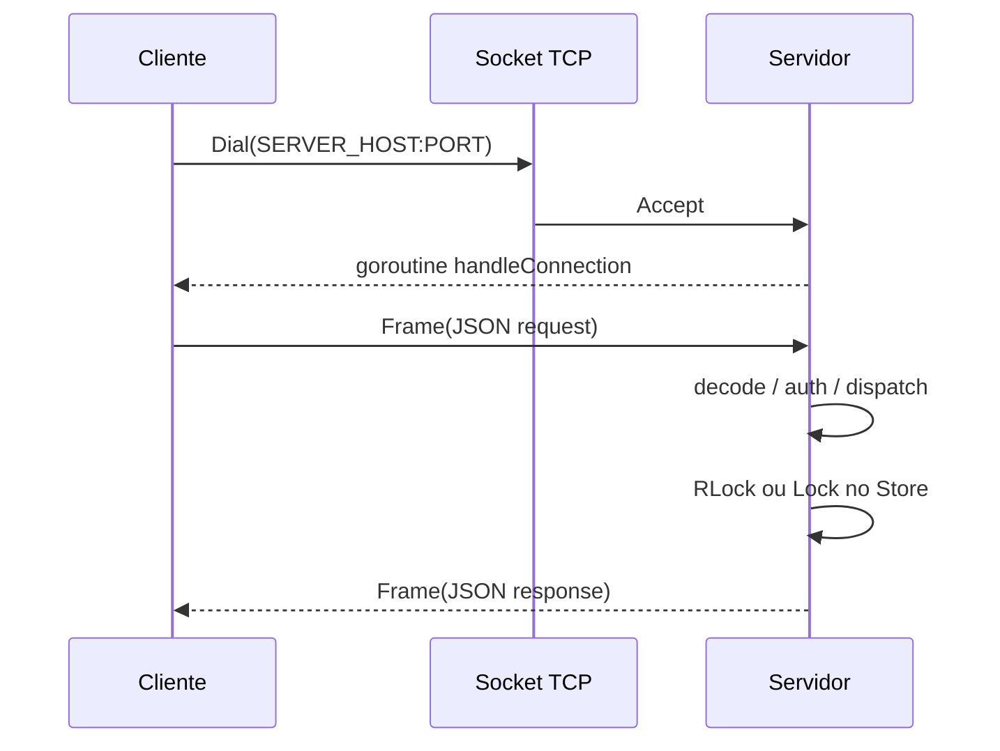

# Arquitetura

## Componentes

| Componente | Papel |
|---|---|
| `cmd/server` | Único processo servidor. Accept loop + 1 goroutine/conexão. |
| `cmd/driver` | CLI motorista: publicar, listar, passageiros por trecho, cancelar carona. |
| `cmd/passenger` | CLI passageiro: buscar, confirmar, listar, cancelar reserva. |
| `internal/protocol` | Framing + envelope JSON. |
| `internal/store` | Estado canônico e persistência. |
| `internal/search` | Grafo derivado das caronas (DFS). |
| `internal/client` | Biblioteca TCP dos CLIs e testes. |

Não há réplica, banco, Redis nem broker. Um servidor central, como o enunciado pede.

## Modelo de dados

- **User**: `userId`, `username`, senha de protótipo, `role` (`DRIVER`\|`PASSENGER`).
- **Ride / Carona**: rota `cities[]`, data, horário de partida, `capacity`, `status`.
- **Segment / Trecho**: par adjacente da rota, `price` (centavos), `availableSeats`. Duas caronas com a mesma rota são entidades distintas (`INV-8`).
- **Reservation / Reserva**: lista de `legs` (intervalo contínuo numa carona), `totalPrice`, `status`.
- **Itinerary**: resultado efêmero da busca; **não** é posse de vaga (`INV-5`).

Disponibilidade é **por trecho**. Passageiro A→C numa rota A-B-C-D consome A-B e B-C; C-D permanece.

## Cliente-servidor

O mutex **não** envolve leitura/escrita de socket.

## Persistência

Na subida, o servidor lê `DATA_PATH`. Se o arquivo não existe, grava o seed de usuários. Mutações gravam JSON atômico (`*.tmp` + `rename`) ainda sob o `Lock`. Em Docker o diretório `/data` é volume. A sessão TCP **não** está no arquivo.

## Onde está o código

- Accept + sessão: `internal/server/server.go`
- Confirmação atômica: `internal/store/reserve.go` (`ConfirmReservation`)
- Grafo: `internal/search/graph.go`
- Framing: `internal/protocol/frame.go`
