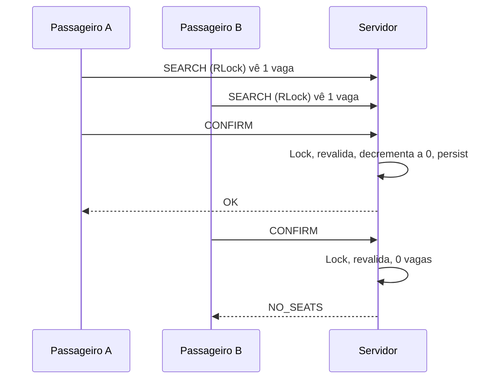

# Concorrência

## Duas camadas (não confundir)

1. **Goroutine por conexão** — atendimento simultâneo de clientes (barema 6).
2. **`sync.RWMutex` no Store** — exclusão mútua sobre caronas/reservas (barema 6 e 7).

Goroutine sem mutex = data race. Mutex sem goroutines = servidor serial no Accept.

## Classificação das operações

| RLock (vários leitores) | Lock (um escritor) |
|---|---|
| SEARCH_ITINERARIES | PUBLISH_RIDE |
| LIST_DRIVER_RIDES | CANCEL_RIDE |
| LIST_RESERVATIONS | CONFIRM_RESERVATION |
| LIST_RIDE_PASSENGERS | CANCEL_RESERVATION |
| LOGIN (leitura de usuários) | REGISTER |

`PING` não toca o Store.

A trava é adquirida **depois** de ler e validar o frame, e liberada **antes** de `WriteFrame`.

## Por que um RWMutex global

Na escala do PBL, serializar escritas é simples de explicar e elimina deadlock de ordem. Confirmar um itinerário de várias caronas acontece numa única seção crítica: ou todos os trechos são decrementados, ou nenhum.

Equivalência com “travas dos trechos” (barema 7): o lock global é como adquirir **todas** as travas de trecho ao mesmo tempo, sempre na mesma ordem (há só uma). Por isso não existe o ciclo Ride1 espera Ride2 / Ride2 espera Ride1.

## Atomicidade da reserva

```text
Lock
  1. lookup de idempotência (passengerId|requestId)
  2. expandir legs → índices de segmento (caminho válido na carona)
  3. mesma departureDate em todas as caronas
  4. rejeitar (rideId, segmentIndex) repetido no pedido (VALIDATION_ERROR)
  5. revalidar availableSeats >= 1 em TODOS
  6. legs consecutivas: destino → origem seguinte
  7. se algum falhar: Unlock, estado intacto (sem clamp de negativo)
  8. decrementar todos, gravar Reservation CONFIRMED
  9. persistir JSON
Unlock
WriteFrame
```

Um pedido com a mesma carona Salvador→Jequié duas vezes (capacidade 1) **não** confirma e **não** deixa `availableSeats = -1`: o segmento é visto duas vezes no passo 4 e o confirm aborta. Sobreposição parcial (A→C e B→C) cai na mesma regra.

Busca ≠ reserva. Dois `SEARCH` podem ver 1 vaga; só um `CONFIRM` vence.

## Corrida de dois passageiros



Quem confirma primeiro = quem o servidor processa primeiro dentro do `Lock`.

## Cancelamento

- Passageiro: restaura cada segmento ativo **uma vez**. Segunda chamada encontra `CANCELLED` e não soma de novo (`INV-4`).
- Motorista: marca a carona `CANCELLED`; reservas que a usam viram `CANCELLED`; assentos de **outras** caronas do itinerário composto voltam.

## Invariantes (testadas)

- INV-1 disponibilidade ≥ 0
- INV-2 disponibilidade ≤ capacity
- INV-3 confirmação composta tudo-ou-nada
- INV-4 restore uma vez
- INV-5 busca não reserva
- INV-6 cliente morto não derruba servidor
- INV-8 caronas irmãs têm IDs distintos
- INV-9 JSON inválido não muta estado
- INV-10 sucesso só depois da mutação atômica (+ persistência)

## Deadlock e race

Deadlock de locks: evitado pela trava única. Deadlock de I/O: evitado porque o lock não espera a rede. Race de map: todo acesso ao Store é com RLock/Lock — `go test -race ./...` deve permanecer limpo.

## Falha no meio da reserva

Se o cliente cair **antes** do CONFIRM: nada foi mutado. Se cair **depois** do CONFIRM atômico e **antes** de ler a resposta: a reserva existe; o cliente reenvia o mesmo `requestId` e recebe a mesma reserva (idempotência). Assentos não ficam bloqueados “para sempre” sem uma Reservation correspondente.
